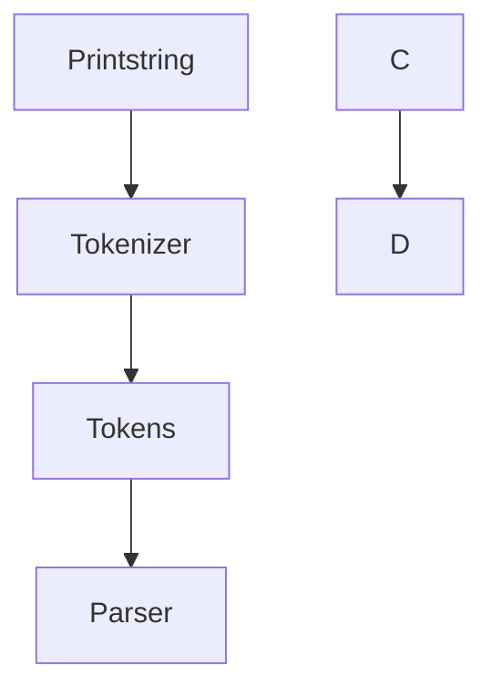

**TOKENIZER** (lexical analysis)
- to take single characters into a recognizable string of tokens.
- Turning into tokens makes it easier to work with.
- Tokens have a type: value [ID: "print"] [String: "Hello"]
- Does not care if program is syntactically valid
- EX:
  > if req    
  // Previous 'if' and 'req' creates the following tokens:
  token_1 = [keyword: "if"]  
  token_2 = [op: "req"]
  
**PARSER** (syntactic analysis)
- Actually checks if the syntax is valid!